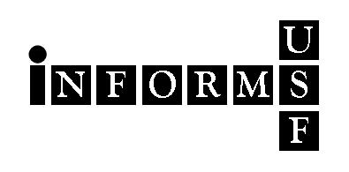

Slides for Code & Data Boot Camp 2014
=====================================

Hosted by [INFORMS](http://informs.eng.usf.edu) at the [University of South Florida](http://usf.edu).

My slides and materials for the R sessions at USF Code & Data Boot Camp 2014.

- *Getting StaRted in R*
- *Intro to Data Science with R*
- *Reporting Reproducible Research with R and Markdown*
