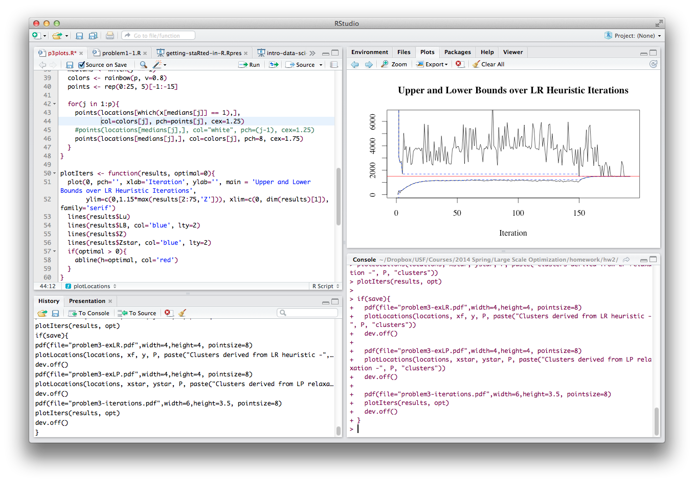

% getting staRted in R
% Garrick Aden-Buie // Friday, March 25, 2016
% INFORMS Code & Data Boot Camp

```{r setup, include=FALSE}
knitr::opts_chunk$set(echo=T, warning=F, error=T, message=F, cache=FALSE,
               fig.path='getting-staRted-figures/', dev='png', dpi=96, par=TRUE,
               tidy=F, prompt=F, collapse=T,
               resize.height=4, fig.width=7, fig.height=5,
               out.format = 'markdown')
options(width=80, digits=3)

knitr::knit_hooks$set(par=function(before, options, envir){
if (before && options$fig.show!='none'){
  par(mar=c(5,4,1,1), bg='white')
  }
})

```


## Today we'll talk about


- The R Universe
- Getting set up
- Working with data
- Base functions
- Where to go from here

Find these slides at <https://github.com/gadenbuie/usf-boot-camp-R>

## Here's what you need to start

- Install **R**
    - [cloud.r-project.org](https://cloud.r-project.org/)
    
- Install **R-Studio** 
    - [rstudio.com](https://www.rstudio.com/)
    
- Download the companion code to this talk
    - [`http://bit.ly/1q5Rfpy`](http://bit.ly/1q5Rfpy)

# The R Universe

## What is R?

- R is an *Open Source* and free programming language for statistical computing and graphics, based on it predecessor S.

- Available for Windows, Mac, and Linux

- Under active development

- R can be easily extended with "packages": 
  - code, data and documentation

## Why use R?

- Free and open source

- Excellent and robust community

- One of the most popular tools for data analysis

- Growing popularity in science and hacking
    - [Article in Fast Company](http://www.fastcolabs.com/3028381/how-the-rise-of-the-r-computer-language-is-bringing-open-source-to-science)
    
- Among the highest-paying IT skills on the market
    - [2014 Dice Tech Salary Survey](http://blog.revolutionanalytics.com/2014/02/r-salary-surveys.html)

- So many cool projects and tools that make it easy to collaborate with others and publish your work

## Pros of using R

- Available on any platform

- Source code is easy to read

- Lots of work being done in R now, with an excellent and open professional and academic community

- Plays nicely with many other packages (SPSS, SAS)

- Bleeding edge analyses not available in proprietary packages

## Some downsides of R

- Older language that can be a little quirky

- User-~~driven~~ supplied features

- It's a programming language, not a point-and-click solution

- Slower than compiled languages
    - To speed up R you vectorize
    - Opposite of other languages
  
## Some R Vocab

\footnotesize

| Term              | Description                                     |
|-------------------+-------------------------------------------------|
| console, terminal | The "main" portal to R where you enter commands |
| scripts           | Your "program" or text file containing commands |
| functions         | Repeatable blocks of commands                   |
| working directory | Default location of files for input/output      |
| packages          | "Apps" for R                                    |
| vector            | The basic unit of data in R                     |
| dataframe         | Data organized into rows and columns            |

<http://adv-r.had.co.nz/Vocabulary.html>

## The R Console


## R Studio: Standard View


## R Studio: My personalized view



## Take it for a quick spin

```{r easy-stuff}
3+3
sqrt(4^4)
2==2
```

## Setting up RStudio

- Under settings, move panes to where you want them to be

- Change font colors, etc

- Browse to downloaded companion script in **Files** pane

- Open script and set working directory

## Where to get help

- Every R packages comes with documentation and examples
    - Try `?summary` and `??regression`
    - RStudio + tab completion = FTW!

- Get help online
    - [StackExchange](http://stackexchange.com)
    - Google (add `in R` or `R stats` to your query)
    - [RSeek](http://www.rseek.org/)

- For really odd messages, copy and paste error message into Google

## Working directory

Set working directory with

```r
setwd("path/to/directory/")
```

Check to see where you are with

```r
getwd()
```

## Packages

Install packages[^1]

```r
install.packages('ggplot2')
```

Load packages

```r
library(ggplot2)
```

Find packages on [CRAN](http://cran.r-project.org/) or [Rdocumentation](http://www.rdocumentation.org/). Or

```r
?ggplot
```

[^1]: Windows 7+ users need to run RStudio with System Administrator privileges.


# Basics of the language

## Basic Operators

```r
2 + 2
2/2
2*2
2^2
2 == 2
42 >= 2
2 <= 42
2 != 42
23 %/% 2   # Integer division -> 11
23 %% 2    # Remainder -> 1
```

## Key Symbols

```{r key-symbols}
x <- 10         # Assigment operator
y <- 1:x        # Sequence
y[2]            # Element selection
"str" == 'str'  # Strings
```

## Functions

Functions have the form `functionName(arg1, arg2, ...)` and arguments always go inside the parenthesis.

Define a function:

```{r functions}
fun <- function(x=0){
  # Adds 42 to the input number
  return(x+42)
}
fun(8)
```

## Data types

```r
1L          # integer
1.0         # numeric
'1'         # character
TRUE == 1   # logical
FALSE == 0  # logical
NA          # NA
factor()    # factor
```

You can check to see what type a variable is with `class(x)` or `is.numeric()`.

# Data Structures

## Vectors

Basic data type is a vector, built with `c()` for **concatenate**.

```{r}
x <- c(1, 2, 3, 4, 5); x
y <- c(6:10); y
```


## Working with vectors

```{r working-with-vectors}
a <- sample(1:5, 10, replace=TRUE)
length(a)
unique(a)
length(unique(a))
a * 2
```


## Strings

Strings use either the `' '` or the `" "` characters.

```{r strings}
mystr <- 'Glad you\'re here'
print(mystr)
```

Use `paste()` to concatenate strings, not `c()`.

```{r strings2}
paste(mystr, '!', sep='')
c(mystr, '!')
```

## Matrices: binding vectors

Matrices can be built by row binding or column binding vectors:

```{r}
cbind(x,y)   # 5 x 2 matrix
rbind(x,y)   # 2 x 5 matrix
```

## Matrices: matrix function

Or you can build a matrix using the `matrix()` function:

```{r matrix}
matrix(1:10, nrow=2, ncol=5, byrow=TRUE)
```

## Coercion

Vectors and matrices need to have elements of the same type, so R pushes mismatched elements to the best common type.

```{r}
c('a', 2)
c(1L, 1.0)
c(1L, 1.1)
```


## Recycling

Recycling occurs when a vector has mismatched dimensions. R will fill in dimensions by *repeating* a vector from the beginning.

```{r}
matrix(1:5, nrow=2, ncol=5, byrow=FALSE)
```


## Factors

Factors are a special (at times frustrating) data type in R.

```{r}
x <- rep(1:3, 2)
x
x <- factor(x, levels=c(1, 2, 3), 
            labels=c('Bad', 'Good', 'Best'))
x
```

## Ordering factors

Order of factors is important for things like plot type, output, etc. Also factors are really two things tied together: the data itself and the labels.

```{r}
x[order(x)]
x[order(x, decreasing=T)]
```

## Ordering factor labels

That reordered the elements of `x`, but not the factor levels.

Compare:

```{r}
factor(x, levels=c('Best', 'Good', 'Bad'))
factor(x, labels=c('Best', 'Good', 'Bad'))
```

## Squashing factors

What if you want your drop the "factor" and keep the data?

**Keep the numbers**[^numfac]

[^numfac]: Risky, order matters!

```{r}
as.numeric(x)
```

**Keep the labels**

```{r}
as.character(x)
```

## Lists

Lists are arbitrary collections of objects. They don't have to be the same type or element or have the same dimensions.

```{r}
mylist <-  list(vec = 1:5, str = "Strings!")
mylist
```

## Finding list elements

Use double brackets to return the list item or the `$` operator.

```{r}
mylist[[1]]
mylist$str
mylist$vec[2]
```

## Data frames

Data frames are like matrices, but better. Column vectors are *not* required to be the same type, so they can handle diverse data.

```{r df-diamonds, results='hide'}
require(ggplot2)
data(diamonds, package='ggplot2')
head(diamonds)
```

\footnotesize

```{r df-diamonds2, results='asis', echo=FALSE}
knitr::kable(head(diamonds))
```


## Building a data frame

Data frames require vectors of the same dimension, but not the same type.

```{r dataframes}
mydf <- data.frame(My.Numbers = sample(1:10, 6),
                   My.Factors = x)
mydf
```


## Naming columns and rows

Data frames and matrices can have named rows and columns.

```{r names}
names(mydf)
```

```r
colnames(mydf) <- c('Num', 'Fak')  # Set column names
rownames(mydf)                     # Same for rows
```

To find the dimensions of a matrix or data frame (*rows*, *cols*):

```{r dim}
dim(mydf)
```


## Reading and writing data in data frames

R works well with Excel and CSV files, among many others. I usually work with CSV, but that's mostly personal preference.

**Reading data**

```r
mydata <- read.csv('filename.csv', header=T)
```

**Writing data**

```r
write.csv(mydata, 'filename.csv')
```


# Control structures

## `if`, `else if`, `else`

```{r ifelse}
a <- 10
if(a > 11){
  print('Bigger!')
} else if(a < 9){
  print('Smaller!')
} else {
  print('On the money!')
}
```

## `for` loops

```{r for}
z <- c()
for(i in 1:10){
  z <- c(z, i^2)
}
z
```

## `while` loops

```{r while}
z <- c()
i <- 1

while(i <= 5){
  z <- c(z, i^3)
  i <- i+1
}

z
```


# Manipulating data

## `mtcars` data frame

R includes a number of datasets in the package `datasets` including `mtcars`. Try `?mtcars` to learn more. The data was extracted from the 1974 issue of *Motor Trend*. 

If entering `mtcars` doesn't work, run `data(mtcars)` first.

```{r mtcars1, results='hide'}
head(mtcars)
```

\tiny

```{r mtcars, results='asis', echo=FALSE}
knitr::kable(head(mtcars))
```

## Selecting rows and columns

\footnotesize

Rows and columns are selected using brackets:

```r
dataframe[<row conditions>, <column conditions>]
```

For example, `mtcars[1,2]` returns row 1, column 2:

```{r row-col}
mtcars[1,2]
```

Select a whole row by leaving the column blank

```{r row}
mtcars[1,]
```

or similarly select a column by leaving the row condition blank

```{r col,}
mtcars[,'qsec'][1:10]
```

## More ways to select rows and columns

```r
mtcars[-1,]               # Drop first row
mtcars[, -2:-4]           # Drop columns 2-4
mtcars[, c('mpg', 'cyl')] # Only mpg and cyl columns
mtcars[c(1,5,8,10),'am']
mtcars['Valiant',]        # Works when rows have names
mtcars$mpg                # Select 'mpg' col
mtcars[[1]]               # Same
mtcars[['mpg']]           # Also the same
mtcars$mpg[1:5]           # == mtcars[1:5, 'mpg']
```

## Subsetting

What if you want to look at the gas guzzlers only?

```{r gas-guzzle, results='hide'}
gas_guzzlers <- mtcars[mtcars$mpg < 20,]
head(gas_guzzlers)
```

\tiny

```{r gas-guzzle-table, results='asis', echo=FALSE}
knitr::kable(head(gas_guzzlers))
```

## Subsetting

Or 6-cylinder gas guzzlers only...

```{r gas-guzzle6, results='hide'}
gas_guzzlers <- mtcars[mtcars$mpg < 20 & mtcars$cyl == 6,]
head(gas_guzzlers)
```

\tiny

```{r gas-guzzle-table6, results='asis', echo=FALSE}
knitr::kable(head(gas_guzzlers))
```

## Setting values based on subsets

Create a new column for speed class based on quarter mile time.

```{r qsec}
mtcars[mtcars$qsec < 17, 'Class'] <- 'Slow'
mtcars[mtcars$qsec > 17, 'Class'] <- 'Medium'
mtcars[mtcars$qsec > 20, 'Class'] <- 'Fast'
table(mtcars$Class)
```

Any expression that evaluates to `TRUE` or `FALSE` can be used as a column or row condition.

```{r tf}
mtcars$qsec[1:10] > 17
```

## Dealing with missing values

Missing values show up as `NA`s, which is actually a data type.

```{r missing}
foo <- c(1.2, NA, 2.4, 6.2, 8.3)
bar <- c(9.1, 7.6, NA, 1.1, 4.7)
fb <- cbind(foo, bar)
fb[complete.cases(fb),]
foo[!is.na(foo)]
```

# Base functions

## All around great functions: `summary`

**Summarize just about anything**

```{r summary, width=60}
summary(mtcars[,1:3])
```

## All around great functions: `str`

**"Quick look" function**

\footnotesize

```{r str}
str(mtcars)
```

## All around great functions: `attributes`

**Learn more about the object**

\footnotesize

```{r attribute}
attributes(mtcars[1:10,])
```

## All around great functions: `table`

**Quick and dirty tables**

```{r tables}
table(mtcars$cyl, mtcars$gear)
```

## Basic functions for vectors

```r
sum()   
mean()  
sd()     # standard deviation
max()
min()
median()
range()
rev()    # reverse
unique() # unique elements
length()
```

# Visualizing data

## Plotting points

```{r plot-points, fig.cap=''}
plot(mtcars$wt, mtcars$mpg,
     xlab='Weight', ylab='MPG')
```

## Plotting lines

```{r lines, fig.cap=''}
plot(presidents, type='l',
     xlab = 'Approval Rating')
```

## Histograms

```{r hist, fig.cap=''}
par(mar=c(5,4,1,1), bg='white')
hist(mtcars$qsec, xlab='Quarter Mile Time')
```

## Bar plots

```{r barplot, fig.cap=''}
barplot(table(mtcars$Class))
```

# Base stats information

## `r*`, `p*`, `q*`, `d*` functions

For all of the statistical distributions, R uses the following naming conventions (incredible how useful this is!):

- `d*` = density/mass function
- `p*` = cumulative distribution function
- `q*` = quantile function
- `r*` = random variate generation

There are quite a few distributions available in base R packages. Just run `?Distributions` to see a full list.

## `rnorm()` example

```{r rnorm, fig.cap=''}
hist(rnorm(100))
```


## Better than base packages

- Manipulating data
    - [ddply] and [plyr] and now [dplyr]
- Visualizing data
    - [ggplot2]
- Reporting data
    - [knitr]
- Interactive online R sessions
    - [shiny]
    
[ddply]: http://cran.r-project.org/web/packages/plyr/plyr.pdf
[plyr]: http://plyr.had.co.nz/
[dplyr]: http://blog.rstudio.org/2014/01/17/introducing-dplyr/
[ggplot2]: http://ggplot2.org/
[knitr]: http://yihui.name/knitr/
[shiny]: http://www.rstudio.com/shiny/


# Go ExploR

## Resources for learning more

- [Advanced R Programming](http://adv-r.had.co.nz/) 
    - By one of the best and most important R developers.

- [TwoTorials](http://www.twotorials.com/)
    - Quick two minute videos on doing things in R.

- [An R Meta Book](http://blog.revolutionanalytics.com/2014/03/an-r-meta-book.html)
    - A collection of online books.

- [R Bloggers](http://www.r-bloggers.com/)
    - A mailing list and central hub of all things online regarding R.
    

# Thanks!


