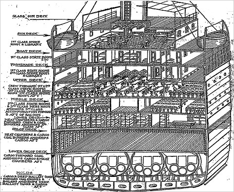
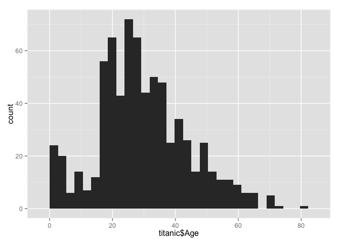
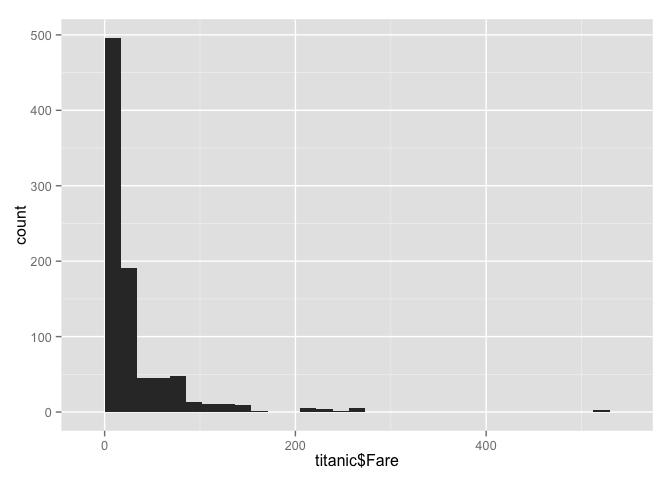
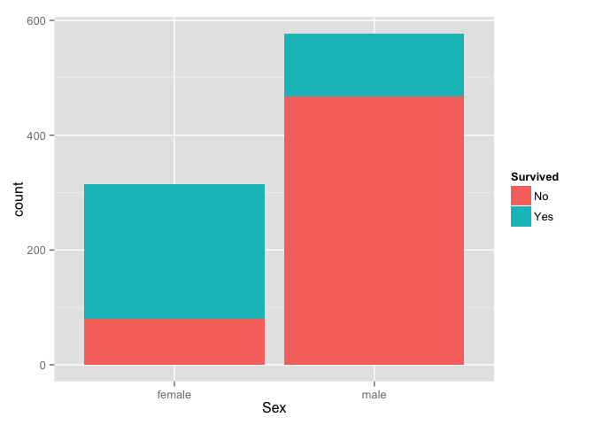
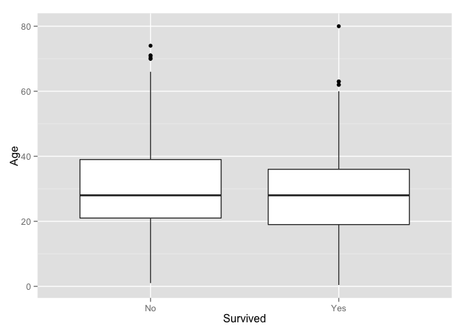
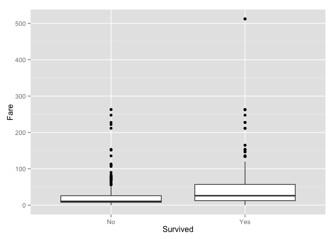
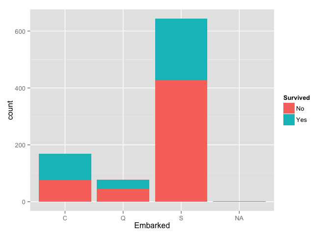
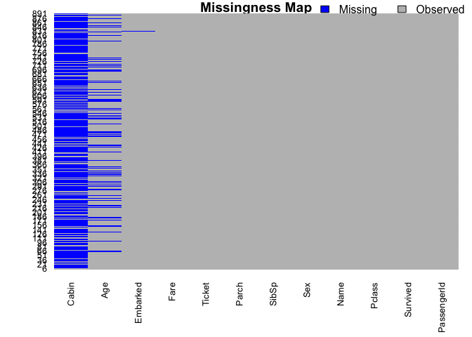
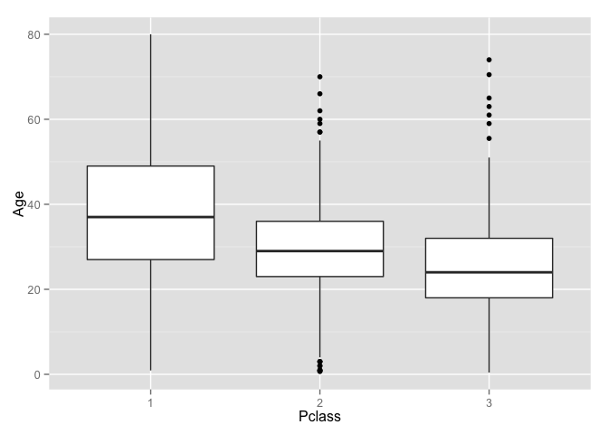
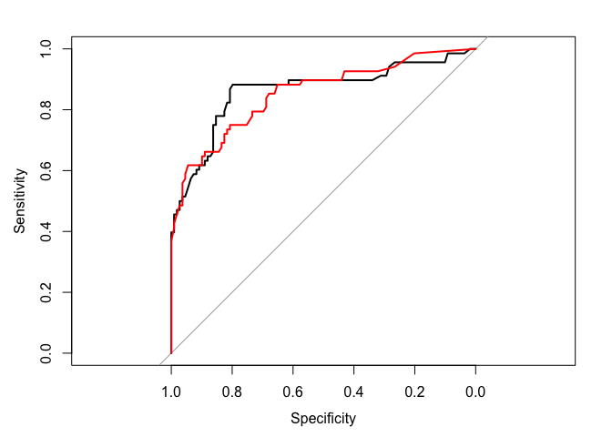

% Doing Data Science in R
% Garrick Aden-Buie // April 11, 2014
% INFORMS Code & Data Boot Camp


## Intro

In this project we'll do a simple data science project
based on the [Kaggle Titanic Challenge][kaggle-titanic].

[kaggle-titanic]: http://www.kaggle.com/c/titanic-gettingStarted

**Overview**

- Data Exploration
- Data Cleaning
- Training a Model
- Fitting a Model

\scriptsize

*Big thanks*: Draws heavily from <http://statsguys.wordpress.com/2014/01/03/first-post/>
and <https://github.com/wehrley/wehrley.github.io/blob/master/SOUPTONUTS.md>.
Much more detail available there!


## Who survives the Titanic?




## Getting started

- Download the CSV and R script file from <http://bit.ly/USFCodeCamp2014>

- Open the R script

- Set your working directory


# The data

## Loading the data


```r
titanic <- read.csv('titanic.csv', header = TRUE,
                     na.strings=c('NA', ''))

titanic$Survived <- factor(titanic$Survived, 
                           labels=c('No', 'Yes'))
titanic$Pclass <- factor(titanic$Pclass)
```


## Quick look at the data


```r
names(titanic)
```

```
##  [1] "PassengerId" "Survived"    "Pclass"      "Name"        "Sex"        
##  [6] "Age"         "SibSp"       "Parch"       "Ticket"      "Fare"       
## [11] "Cabin"       "Embarked"
```


Also look at:

```r
head(titanic)
summary(titanic)
str(titanic)
```

## Variable Meanings

\scriptsize

| Variable | Meaning                                          |
|----------|--------------------------------------------------|
| survival | Survival                                         |
|          | (0 = No; 1 = Yes)                                |
| pclass   | Passenger Class                                  |
|          | (1 = 1st; 2 = 2nd; 3 = 3rd)                      |
| name     | Name                                             |
| sex      | Sex                                              |
| age      | Age                                              |
| sibsp    | Number of Siblings/Spouses Aboard                |
| parch    | Number of Parents/Children Aboard                |
| ticket   | Ticket Number                                    |
| fare     | Passenger Fare                                   |
| cabin    | Cabin                                            |
| embarked | Port of Embarkation                              |
|          | (C = Cherbourg; Q = Queenstown; S = Southampton) |

## Plotting age


```r
require(ggplot2)
qplot(titanic$Age, geom='histogram')
```

 


## Plot Fare


```r
qplot(titanic$Fare, geom='histogram')
```

 


## Survival by gender


```r
table(titanic$Survived, titanic$Sex)
```

```
##      
##       female male
##   No      81  468
##   Yes    233  109
```


## Survival by gender plot


```r
ggplot(titanic, aes(x=Sex, fill=Survived))+geom_histogram()
```

 


## Survival by Passenger Class


```r
table(titanic$Survived, titanic$Pclass)
```

```
##      
##         1   2   3
##   No   80  97 372
##   Yes 136  87 119
```


## Survival by Passenger Class plot


```r
ggplot(titanic, aes(x=Pclass, fill=Survived))+
  geom_histogram(binwidth=1)
```

 


## Survival by Age


```r
ggplot(titanic, aes(x=Survived, y=Age))+geom_boxplot()
```

 


## Survival by Fare


```r
ggplot(titanic, aes(x=Survived, y=Fare))+geom_boxplot()
```

 


## Survival by Port


```r
ggplot(titanic, aes(x=Embarked, fill=Survived))+geom_histogram()
```

 


## Thoughts?

. . .


```r
require(Amelia)
missmap(titanic, col=c('blue', 'grey'))
```

 


# Cleaning the data

## Missing values

Clearly we need to work on the missing values.
Let's ignore `Cabin` and drop passengers missing `Embarked`.


```r
names(titanic)
```

```
##  [1] "PassengerId" "Survived"    "Pclass"      "Name"        "Sex"        
##  [6] "Age"         "SibSp"       "Parch"       "Ticket"      "Fare"       
## [11] "Cabin"       "Embarked"
```

```r
titanic <- titanic[, -11]
titanic <- titanic[!is.na(titanic$Embarked),]
```


But we definitely need to fix `Age`


```r
length(titanic[is.na(titanic$Age),'Age'])/dim(titanic)[1]
```

```
## [1] 0.199
```


## Does Passenger Class Help?


```r
ggplot(titanic, aes(x=Pclass, y=Age))+geom_boxplot()
```

 


maybe...


## What about the passenger names?


```r
rrows <- c(766, 490, 509, 384, 34, 
           126, 887, 815, 856, 851)
titanic[rrows, 'Name']
```

```
##  [1] Brewe, Dr. Arthur Jackson               
##  [2] Hagland, Mr. Konrad Mathias Reiersen    
##  [3] Lang, Mr. Fang                          
##  [4] Plotcharsky, Mr. Vasil                  
##  [5] Wheadon, Mr. Edward H                   
##  [6] McMahon, Mr. Martin                     
##  [7] Johnston, Miss. Catherine Helen "Carrie"
##  [8] Fry, Mr. Richard                        
##  [9] Daly, Mr. Peter Denis                   
## [10] Boulos, Miss. Nourelain                 
## 891 Levels: Abbing, Mr. Anthony ... Zimmerman, Mr. Leo
```


## Passenger Titles

The following titles have at least one person missing `Age`

- Dr.
- Master.
- Miss.
- Mr.
- Mrs.

These titles are clearly correlated with passenger age.

## How we're going to do this

- Find indexes of Names that contain `Dr.`


```r
dr <- grep('Dr.', titanic$Name, fixed=TRUE); dr
```

```
## [1] 245 317 398 632 660 766 796
```


- Calculate median age for those passengers


```r
m_age <- median(titanic[dr, 'Age'], na.rm=TRUE); m_age
```

```
## [1] 46.5
```


- Select indexes that are both missing and have `Dr.`


```r
dr[dr %in% which(is.na(titanic$Age))]
```

```
## [1] 766
```


## Impute Age with median age for titles


```r
titles <- c('Dr.', 'Master.', 'Miss.', 'Mr.', 'Mrs.')
```


\footnotesize


```r
for(title in titles){
  passengers <- grep(title, titanic$Name, fixed=TRUE)
	median_age <- median(titanic[passengers, 'Age'], na.rm=TRUE)
	titanic[passengers[passengers %in% which(is.na(titanic$Age))],
           'Age'] <- median_age
}
```


## Adding features: Child?

Add a feature to indicate if the passenger is a child (<12)


```r
titanic$Child <- 'No'
titanic[titanic$Age <= 12, 'Child'] <- 'Yes'
titanic$Child <- factor(titanic$Child)
summary(titanic$Child)
```

```
##  No Yes 
## 816  73
```


## Adding features: Mother?

Add a feature to indicate if the passenger is a mother.
Use the variable `Parch` and title `'Mrs.'`

. . .


```r
titanic$Mother <- 'No'
mrs <- grep('Mrs.', titanic$Name, fixed=TRUE)
parent <- which(titanic$Parch > 0)
titanic[mrs %in% parent, 'Mother'] <- 'Yes'
titanic$Mother <- factor(titanic$Mother)
summary(titanic$Mother)
```

```
##  No Yes 
## 493 396
```


# Divide the data

## Divide the data into training and testing sets.

We'll use the `caret` package for this.


```r
require(caret)
require(pROC)
require(e1071)
```


<http://caret.r-forge.r-project.org/>

Can be used as a power tool to test and train models.

## Make a training and testing set


```r
train_index <- createDataPartition(y=titanic$Survived,
                                   p=0.80,
                                   list=FALSE)

train <- titanic[ train_index,]
test  <- titanic[-train_index,]

dim(train)
```

```
## [1] 712  13
```

```r
dim(test)
```

```
## [1] 177  13
```


# Build some models!

## Generalized Linear Model (logistic regression)


```r
train.glm <- glm(Survived ~ Pclass + Sex + Age +
                      Child + Sex+Pclass + Mother +
                      Embarked + Fare,
                    family = binomial,
                    data = train)
```


## Model summary

\scriptsize


```r
train.glm
```

```
## 
## Call:  glm(formula = Survived ~ Pclass + Sex + Age + Child + Sex + Pclass + 
##     Mother + Embarked + Fare, family = binomial, data = train)
## 
## Coefficients:
## (Intercept)      Pclass2      Pclass3      Sexmale          Age     ChildYes  
##    3.419178    -0.755809    -2.256159    -2.591527    -0.022988     0.966996  
##   MotherYes    EmbarkedQ    EmbarkedS         Fare  
##    0.047615    -0.092708    -0.680702     0.000135  
## 
## Degrees of Freedom: 711 Total (i.e. Null);  702 Residual
## Null Deviance:	    947 
## Residual Deviance: 623 	AIC: 643
```


## Anova

\scriptsize


```r
anova(train.glm, test='Chisq')
```

```
## Analysis of Deviance Table
## 
## Model: binomial, link: logit
## 
## Response: Survived
## 
## Terms added sequentially (first to last)
## 
## 
##          Df Deviance Resid. Df Resid. Dev Pr(>Chi)    
## NULL                       711        947             
## Pclass    2     80.5       709        866  < 2e-16 ***
## Sex       1    208.3       708        658  < 2e-16 ***
## Age       1     22.3       707        636  2.4e-06 ***
## Child     1      4.5       706        631    0.034 *  
## Mother    1      0.0       705        631    0.949    
## Embarked  2      8.2       703        623    0.016 *  
## Fare      1      0.0       702        623    0.952    
## ---
## Signif. codes:  0 '***' 0.001 '**' 0.01 '*' 0.05 '.' 0.1 ' ' 1
```


## Set up caret to train models for us

This just reduces repeated typing later


```r
cv.ctrl <- trainControl(method = 'repeatedcv',
                        repeats = 3,
                        summaryFunction = twoClassSummary,
                        classProbs = TRUE)
```


## Train `glm` with caret


```r
glm.train <- train(Survived ~ Pclass + Sex +
                     Age + Child + Embarked,
                   data = train,
                   method = 'glm',
                   metric = 'ROC',
                   trControl = cv.ctrl)
```


## Check results

\scriptsize


```r
glm.train
```

```
## Generalized Linear Model 
## 
## 712 samples
##  12 predictors
##   2 classes: 'No', 'Yes' 
## 
## No pre-processing
## Resampling: Cross-Validated (10 fold, repeated 3 times) 
## 
## Summary of sample sizes: 641, 641, 641, 640, 641, 640, ... 
## 
## Resampling results
## 
##   ROC  Sens  Spec  ROC SD  Sens SD  Spec SD
##   0.9  0.9   0.7   0.05    0.05     0.1    
## 
## 
```


## More details

\tiny


```r
summary(glm.train)
```

```
## 
## Call:
## NULL
## 
## Deviance Residuals: 
##    Min      1Q  Median      3Q     Max  
## -2.729  -0.703  -0.347   0.627   2.508  
## 
## Coefficients:
##             Estimate Std. Error z value Pr(>|z|)    
## (Intercept)  3.45461    0.47136    7.33  2.3e-13 ***
## Pclass2     -0.76580    0.29735   -2.58    0.010 *  
## Pclass3     -2.27045    0.28684   -7.92  2.5e-15 ***
## Sexmale     -2.59190    0.21449  -12.08  < 2e-16 ***
## Age         -0.02303    0.00985   -2.34    0.019 *  
## ChildYes     0.97083    0.41518    2.34    0.019 *  
## EmbarkedQ   -0.09598    0.41284   -0.23    0.816    
## EmbarkedS   -0.67946    0.26390   -2.57    0.010 *  
## ---
## Signif. codes:  0 '***' 0.001 '**' 0.01 '*' 0.05 '.' 0.1 ' ' 1
## 
## (Dispersion parameter for binomial family taken to be 1)
## 
##     Null deviance: 947.02  on 711  degrees of freedom
## Residual deviance: 623.28  on 704  degrees of freedom
## AIC: 639.3
## 
## Number of Fisher Scoring iterations: 5
```


## Random forest model

Let's try the method known as *random forests*. 


```r
set.seed(42)
rf.train <- train(Survived ~ Pclass + Sex +
                     Age + Child + Embarked,
                   data = train,
                   method = 'rf',
                   metric = 'ROC',
                   trControl = cv.ctrl)
```


## Random forests results

\scriptsize


```r
rf.train
```

```
## Random Forest 
## 
## 712 samples
##  12 predictors
##   2 classes: 'No', 'Yes' 
## 
## No pre-processing
## Resampling: Cross-Validated (10 fold, repeated 3 times) 
## 
## Summary of sample sizes: 641, 641, 641, 641, 641, 641, ... 
## 
## Resampling results across tuning parameters:
## 
##   mtry  ROC  Sens  Spec  ROC SD  Sens SD  Spec SD
##   2     0.9  0.9   0.6   0.04    0.04     0.09   
##   4     0.9  0.9   0.6   0.04    0.03     0.09   
##   7     0.9  0.9   0.7   0.04    0.05     0.08   
## 
## ROC was used to select the optimal model using  the largest value.
## The final value used for the model was mtry = 2.
```


# Compare performance 

## Make our predictions


```r
glm.pred <- predict(glm.train, test)
rf.pred  <- predict(rf.train, test)

glm.prob <- predict(glm.train, test, type='prob')
rf.prob  <- predict(rf.train, test, type='prob')
```


## glm prediction results

\tiny


```r
confusionMatrix(glm.pred, test$Survived)
```

```
## Confusion Matrix and Statistics
## 
##           Reference
## Prediction No Yes
##        No  97  26
##        Yes 12  42
##                                         
##                Accuracy : 0.785         
##                  95% CI : (0.717, 0.843)
##     No Information Rate : 0.616         
##     P-Value [Acc > NIR] : 1.07e-06      
##                                         
##                   Kappa : 0.528         
##  Mcnemar's Test P-Value : 0.035         
##                                         
##             Sensitivity : 0.890         
##             Specificity : 0.618         
##          Pos Pred Value : 0.789         
##          Neg Pred Value : 0.778         
##              Prevalence : 0.616         
##          Detection Rate : 0.548         
##    Detection Prevalence : 0.695         
##       Balanced Accuracy : 0.754         
##                                         
##        'Positive' Class : No            
## 
```


## randomForest results

\tiny


```r
confusionMatrix(rf.pred, test$Survived)
```

```
## Confusion Matrix and Statistics
## 
##           Reference
## Prediction  No Yes
##        No  105  28
##        Yes   4  40
##                                         
##                Accuracy : 0.819         
##                  95% CI : (0.754, 0.873)
##     No Information Rate : 0.616         
##     P-Value [Acc > NIR] : 3.78e-09      
##                                         
##                   Kappa : 0.591         
##  Mcnemar's Test P-Value : 4.79e-05      
##                                         
##             Sensitivity : 0.963         
##             Specificity : 0.588         
##          Pos Pred Value : 0.789         
##          Neg Pred Value : 0.909         
##              Prevalence : 0.616         
##          Detection Rate : 0.593         
##    Detection Prevalence : 0.751         
##       Balanced Accuracy : 0.776         
##                                         
##        'Positive' Class : No            
## 
```


## pROC objects for ROC curves


```r
glm.ROC <- roc(response = test$Survived,
               predictor = glm.prob$Yes,
               levels = levels(test$Survived))

rf.ROC  <- roc(response = test$Survived,
               predictor = rf.prob$Yes,
               levels = levels(test$Survived))
```


## ROC Plot


```r
plot(glm.ROC)
plot(rf.ROC, add=TRUE, col="red")
```

 


# Thanks!


