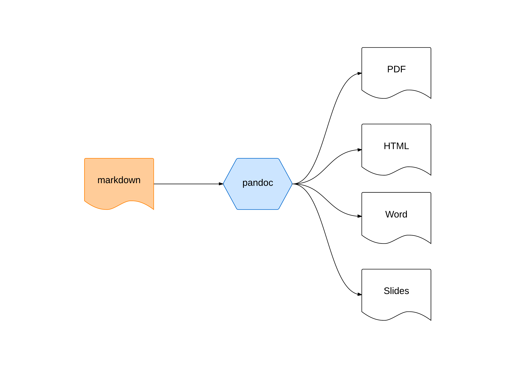
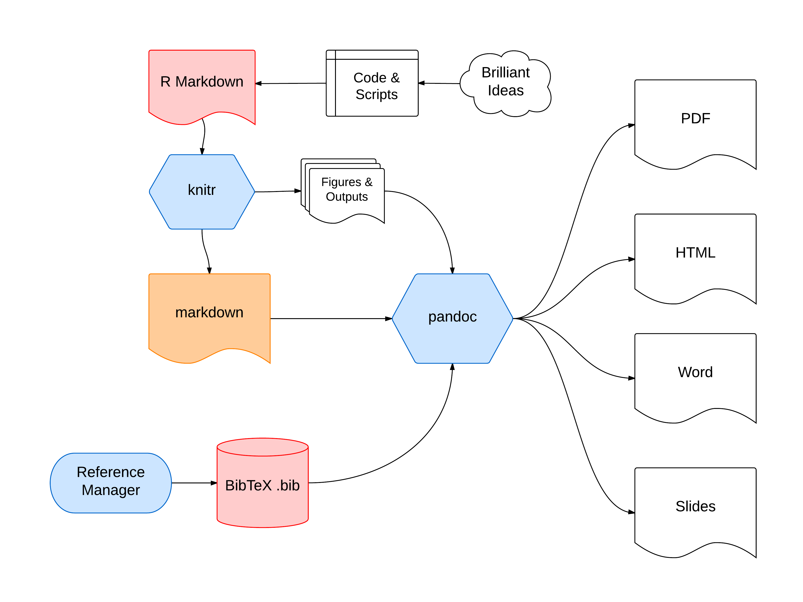
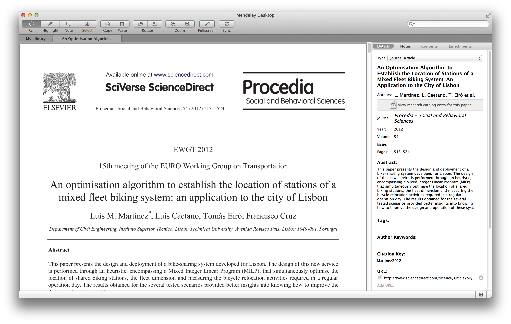
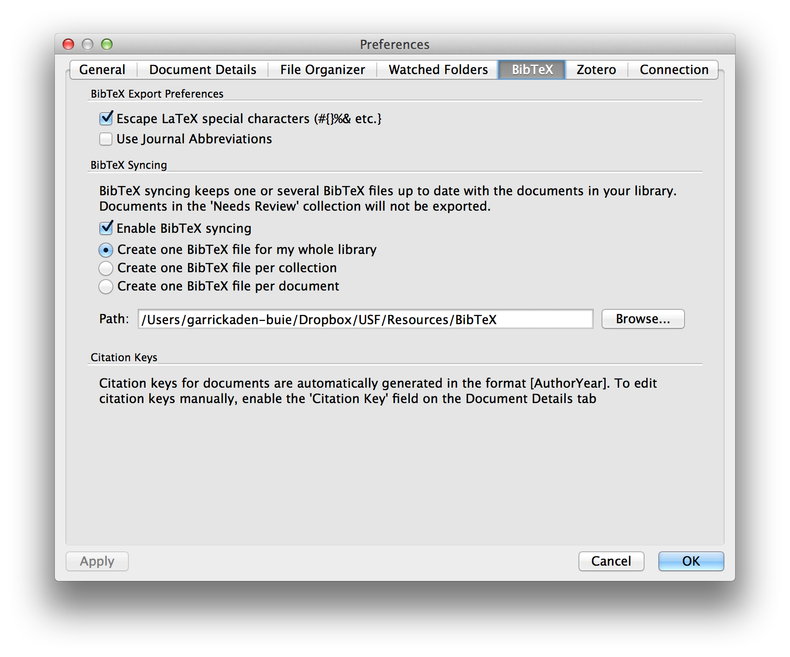
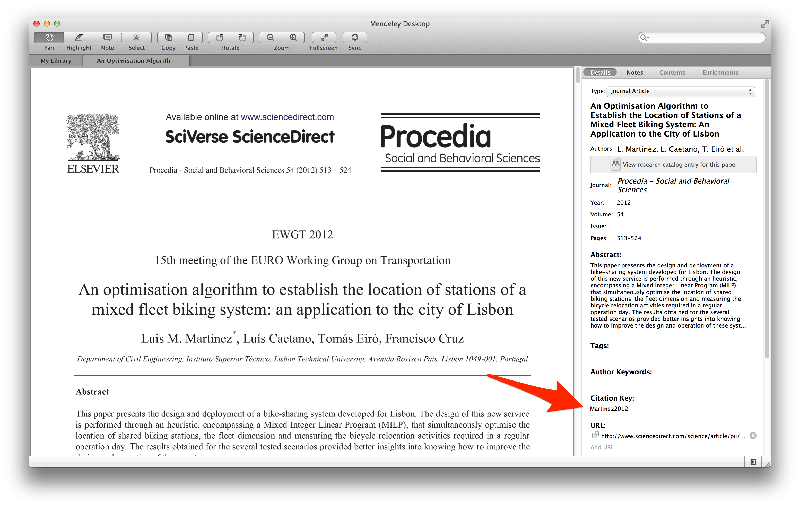

% Reporting Reproducible Research with R and Markdown
% Garrick Aden-Buie // April 11, 2014
% INFORMS Code & Data Boot Camp


## Lots of things to install

- LaTeX
    - Mac: BasicTeX <http://www.tug.org/mactex/morepackages.html>
    - Windows: MiKTeX <http://miktex.org/>
    - Linux: `apt-get install texlive`

- pandoc
    - <http://johnmacfarlane.net/pandoc>

- R
    - <http://r-project.org>
    - [http://rstudio.com][rstudio]
    
- knitr
    - <http://yihui.name/knitr/>
    
- Go all out: git
    - <http://git-scm.org>

## Skip the talk, learn at home

- pandoc user guide
    - <http://johnmacfarlane.net/pandoc/README.html>

- knitr user guide
    - <http://yihui.name/knitr/>
    - <http://kbroman.github.io/knitr_knutshell/>

- git
    - <https://bitbucket.org/gadenbuie/intro-to-git-for-scientists>

[rstudio]: http://rstudio.com

## Today we'll talk about

- What's the deal with Reproducible Research?
- What's up with Markdown?
- A complete research flow
- A simple example
- Show and tell


## What's the deal with Reproducible Research?

- Kind of a hot topic these days
    - [Coursera's course](https://www.coursera.org/course/repdata)
    - [PLoS One Data Policy](http://www.plosone.org/static/policies#sharing)
    - [RunMyCode](https://www.coursera.org/course/repdata)

- Code & Data are as much a part of research output as pubs

### Reproducible research

...is the idea that data analyses, and more generally, scientific claims, are published with their data and software code so that others may verify the findings and build upon them.


## Why should you care?

- **Version Control and Management!**

- Start to finish, integrate everything

- Write once, output to **anything**

- Make collaboration easier[^1] and more scalable

[^1]: YMMV

## Which reminds me...


# A complete research flow

## The core workflow



## The full workflow



## Mendeley



## Set up Mendeley + BibTeX



## Where to find the citekey



## BibTeX entry

**`~/Dropbox/USF/Resources/BibTeX/library.bib`**

\footnotesize

```bibtex
@article{Martinez2012,
  author = {Martinez, Luis M. and Caetano, Luis},
  doi = {10.1016/j.sbspro.2012.09.769},
  issn = {18770428},
  journal = {Procedia - Social and Behavioral Sciences},
  month = oct,
  pages = {513--524},
  title = {{An Optimisation Algorithm to Establish the Location 
          of Stations of a Mixed Fleet Biking System: An Application
          to the City of Lisbon}},
  url = {http://www.sciencedirect.com/science/article/pii/S1877042812042310},
  volume = {54},
  year = {2012}
}
```

# What's up with Markdown?

## What is markdown?

- The `ctrl+B` of plain text

- Many variants, modern markdown father:
    - <https://daringfireball.net/projects/markdown/>

- Lots of variants, but same idea: **plain-text readable markup**
    - MultiMarkdown
    - Github-flavored markdown
    - ReST
    - TeX

- pandoc has it's own special features

- General concept: think like HTML or Word "styles"


# Markdown crash course

## Let's walk through an example together

<http://bit.ly/1qIyQbv>[^mdex]

[^mdex]: http://www.unexpected-vortices.com/sw/gouda/quick-markdown-example.html

## Title

Pandoc allows special syntax on the first three lines for document metadata.

```markdown
% Title
% Author
% 2014-04-11
```

Or [YAML metadata blocks](http://johnmacfarlane.net/pandoc/README.html#yaml-metadata-block).

## Headers

Two ways to make headers, think `<h1>`, `<h2>`, ... levels.

```markdown
An h1 header
============

An h2 header
------------

# Also h1 header

## Also h2 header
```

## Paragraphs

```markdown
Paragraphs are separated by a blank line.
I like starting new sentences on a new line.

It's odd, I know.
```

Paragraphs are separated by a blank line.
I like starting new sentences on a new line.

It's odd, I know.

## Formatting

```markdown
Formatting is easy: *italics*, **bold**, `monospace`, 
~~strikethrough~~.

Also H~2~O and Na^+^.
```

Formatting is easy: *italics*, **bold**, 
`monospace`, ~~strikethrough~~.

Also H~2~O and Na^+^.

## Lists

```markdown
- Item 1
    1. Sub item 1
        
        Still sub item 1
- Item 2
```

- Item 1
    1. Sub item 1
        
        Still sub item 1
- Item 2

## Block quotes

```markdown
> Block quotes are
> written like so.
>
> They can span multiple paragraphs,
> if you like.
```

> Block quotes are
> written like so.
>
> They can span multiple paragraphs,
> if you like.

## Code Sample

Code samples start with three \texttt{`} characters or three `~` or are indented 4 spaces, and can include the code style.

~~~markdown
```r
hist(rnorm(100))
```
~~~

## Tables

Tables can look like this:

```markdown
size  material      color
----  ------------  ------------
9     leather       brown
10    hemp canvas   natural
11    glass         transparent
```

size  material      color
----  ------------  ------------
9     leather       brown
10    hemp canvas   natural
11    glass         transparent

## Tables 2

Or they can also look like this:

```markdown
|size | material     |  color        |
|:----|:------------:|--------------:|
| 9   |  leather     |   brown       |
| 10  |  hemp canvas |   natural     |
| 11  |  glass       |   transparent |

Table: This table has a caption.
```

|size | material     |  color        |
|:----|:------------:|--------------:|
| 9   |  leather     |   brown       |
| 10  |  hemp canvas |   natural     |
| 11  |  glass       |   transparent |

Table: This table has a caption.

## Links

```markdown
There are a [couple] of ways to [make][foo] 
a [link](http://bing.com).
<http://garrickadenbuie.com>

[couple]: http://google.com
[foo]:    http://xkcd.com
```

There are a [couple] of ways to [make][foo] 
a [link](http://bing.com).
<http://garrickadenbuie.com>

[couple]: http://google.com
[foo]:    http://xkcd.com

## Footnotes

```markdown
Footnotes are very similar to links[^disclaimer].

[^disclaimer]: Don't believe everything this guy says.
```

Footnotes are very similar to links[^disclaimer].

[^disclaimer]: Don't believe everything this guy says.

## LaTeX Math

```markdown
Inline math equations go in like so: $\omega = d\phi / dt$. 
Display math should get its own line and be put in in 
double-dollar signs:

$$I = \int \rho R^{2} dV$$
```

Inline math equations go in like so: $\omega = d\phi / dt$. Display
math should get its own line and be put in in double-dollarsigns:

$$I = \int \rho R^{2} dV$$

# pandoc

## Basic pandoc commands

Check out <http://johnmacfarlane.net/pandoc/demos.html>.

1. Markdown to PDF

    ```bash
    $ pandoc text.md -o text.pdf
    ```

2. Markdown to Word

    ```bash
    $ pandoc text.md -o text.docx
    ```
    
3. Markdown to Slides

    ```bash
    $ pandoc -t beamer --template=mybeamer.template
        text.md -o text.pdf
    ```

## Pandoc-syled citations

- `@<citekey>` -- eg. `@Martinez2012`
- `[@<citekey>; @<citekey>]` -- `[@smith04, @Martinez2012]`
- Add `# References` to the end of your document.

```markdown
Blah blah [see @doe99, pp. 33-35; also @smith04, ch. 1].
Smith says blah [-@smith04].
@smith04 says blah.
```

## Processing citations

Two elements:

1. BibTeX file
2. Citation style `.csl`
	- <http://zotero.org/styles>
	
```bash
$ pandoc text.md -o text.pdf
    --bibliography=/path/to/library.bib
    --csl=/path/to/ieee.csl
```

Keep your `.csl`'s and templates somewhere common. 

I use `~/.pandoc/`.


# knitr

## You already know everything... almost

The easiest way to get started is in [R Studio][rstudio]. 

Just select `New > R Markdown`.

To tell **knitr** to process code, just add `r` or `{r}` after code-delimiting markdown. 
You can have *inline* code that runs inside normal `inline code` areas.

You can also have entire code blocks that run R code, called chunks. 
It's best to keep chunks limited to one or grouped outputs (i.e. one table or figure).

## Quick example

```markdown
Inline code evaluations looks like this.
The mean of the sample was `r mean(rnorm(100, mean=10)`
```

~~~markdown
```{r chunk-name, <chunk-opts>}
hist(rnorm(100))
```
~~~

## Best practices

1. After your document metadata, start with a setup chunk.
    - Use this chunk to set global **knitr** options and load packages.
    - Keep data loading and global functions in separate `.R` files and source them here.
    
2. Give chunks names for easier navigation

3. Try to keep chunks self-contained. Inter-chunk dependencies get hairy when debugging.


## Some important chunk options

Best reference is at <http://yihui.name/knitr/options>.

| Option    | Meaning                          |
|-----------|----------------------------------|
| `echo`    | Include R source code in output? |
| `results` | Options about outputting results |
| `error`   | Hard-fail if error?              |
| `include` | Include any output?              |
| `cache`   | Save code chunk results?         |

## A simple example

Grab file from <http://bit.ly/USFCodeCamp2014> and switch to R Studio.

# Show and tell

# Thanks

## Contact

- <http://garrickadenbuie.com>
- [@grrrck](http://twitter.com/grrrck)
- <gadenbuie@mail.usf.edu>
